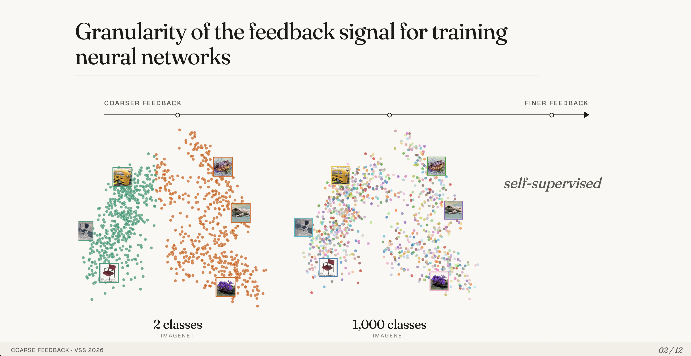
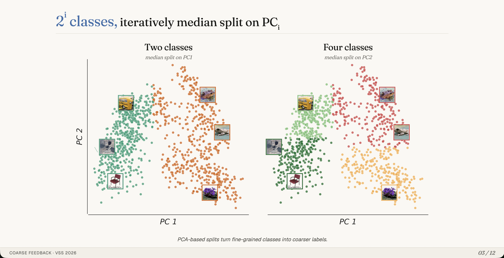
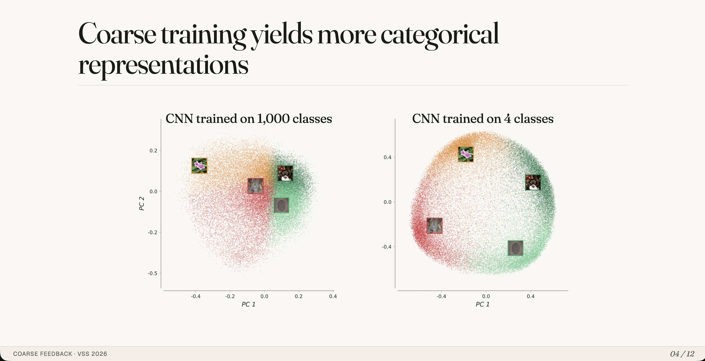
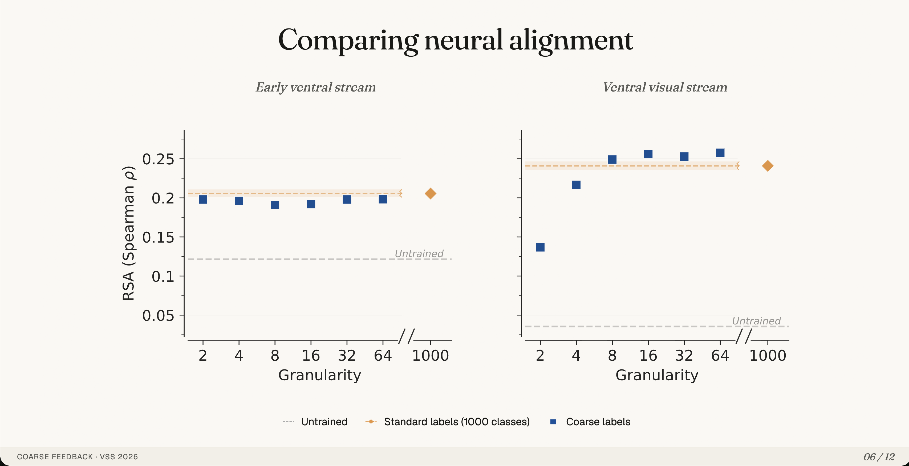
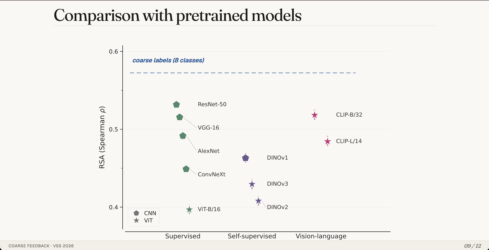
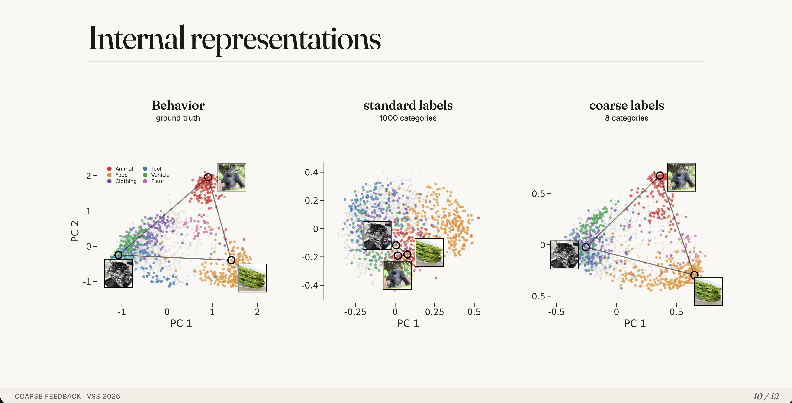

# VSS 2026 Talk Deck

Self-contained HTML slide deck for Yash Mehta's VSS 2026 talk, *An extremely coarse feedback signal for learning human-aligned visual representations*.

The talk asks how far visual representation learning can get with an extremely coarse supervisory signal: instead of using fine-grained ImageNet labels, the model receives binary feedback derived from broad visual similarity structure. The deck walks through that idea, its connection to human and neural alignment, and comparisons against conventional pretrained models.

This repository contains the presentation shell, slide modules, and figure assets for a browser-based talk deck. The deck is authored as plain HTML, CSS, and JavaScript: no bundler, no build step, and no generated framework output. Each slide is an ES module under `slides/`, loaded dynamically by `shell.js`.

- Repository: <https://github.com/yashsmehta/vss-talk>
- Project archive: [download the repository archive](https://github.com/yashsmehta/vss-talk/archive/refs/heads/master.zip)
- Local entry point: `index.html`

## Talk Preview

The screenshots below are shown in the order they were presented.

<p>
  
</p>

<p>
  
</p>

<p>
  
</p>

<p>
  
</p>

<p>
  
</p>

<p>
  
</p>

<p>
  
</p>

<p>
  
</p>

## Run Locally

There are no npm dependencies. ES modules need to be served over HTTP, so do not open `index.html` directly with `file://`.

```bash
python3 -m http.server 8000
```

Then open:

```text
http://localhost:8000
```

Controls:

- Right arrow, Space, or PageDown: advance
- Left arrow or PageUp: go back
- Home or End: jump to start or end
- F: fullscreen
- B: blackout

## Repository Layout

| Path | Purpose |
| --- | --- |
| `index.html` | Browser shell and font loading |
| `shell.js` | Slide loading, keyboard controls, step reveals, scaling |
| `styles.css` | Shared visual system and slide layouts |
| `slides/` | One ES module per slide |
| `images/` | Figure assets used by the deck |
| `images/readme/` | README preview screenshots |
| `DESIGN.md` | Visual-system reference |
| `AGENTS.md` | Project guide and slide sequence |

## Validate Changes

For syntax-only checks:

```bash
node --check shell.js
for f in slides/*.js; do node --check "$f"; done
```

For visual checks, run the local server and step through the talk in a browser.

## Extend The Deck

To adapt this codebase for another project:

1. Create a new slide module in `slides/`, for example `15-new-result.js`.
2. Default-export an object with an `html` string, and optionally `steps`, `onEnter`, `onStep`, and `onLeave`.
3. Add the slide name without `.js` to the `SLIDES` array in `shell.js`.
4. Put figures in `images/` and reference them with relative paths such as `images/my-figure.png`.
5. Use the shared visual system in `styles.css` and `DESIGN.md` rather than hardcoding colors, fonts, or global layout rules inside slide files.

Most title-and-figure slides should use the shared pattern:

```html
<section class="slide figure-slide" style="--fig-max-w: 1500px">
  <header class="slide-title">
    <h2>Slide title</h2>
  </header>
  <figure>
    
  </figure>
</section>
```

For step-by-step reveals, add `step step-N` classes to text, shapes, or inline SVG elements and set `steps: N` in the slide module. The shell applies `.revealed` as the talk advances.

For a new talk, the usual path is:

1. Replace or add image assets under `images/`.
2. Add slide modules under `slides/`.
3. Update the `SLIDES` array in `shell.js` to set the talk order.
4. Keep global design decisions in `styles.css` and `DESIGN.md`.
5. Capture new preview screenshots and replace the images under `images/readme/`.

See `AGENTS.md` for the full project guide and `DESIGN.md` for the visual system.
