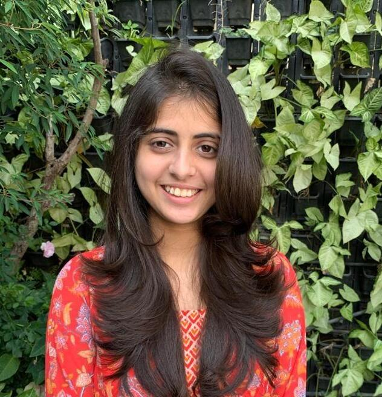

# Plan: Editorial refinements v2.2 — bespoke slides + global polish

Apply the *Editorial refinements* spec (DESIGN.md §"Editorial refinements")
across the deck.

Two parallel workers:
- **Worker A:** bespoke slides — title (real QR), takeaway (em-rule), thanks
  (5 real portraits).
- **Worker B:** global editorial polish — paper-grain on all slides, italic
  Fraunces folio, italic captions.

These touch disjoint regions: Worker A only edits bespoke slide modules + their
slide-specific CSS rules. Worker B only edits global CSS rules (`.slide::before`,
`#progress`, `.caption`) and the title/thanks `::before` opacity overrides.

Manager (Claude) verifies and merges per `~/.claude/skills/delegate/SKILL.md`.

---

## Files to touch

### Worker A
- `slides/01-title.js`, `slides/12-takeaway.js`, `slides/13-thanks.js`
- `styles.css` — only the per-slide rule blocks for `.title-slide`,
  `.takeaway-slide`, `.thanks-slide` and their child selectors

### Worker B
- `styles.css` — only `.slide::before`, `.title-slide::before`,
  `.thanks-slide::before`, `#progress`, `.caption`

### Files NOT to touch (both workers)
- `:root` token block, global `.slide`, `h1`, `.kicker`, `p`, `.placeholder`,
  `.step`, `.step.revealed`, `#footer-strip`, `.footer-left`,
  any figure-bearing slide rules (slides 02–11)
- `shell.js`, `index.html`, `DESIGN.md`, `plan.md`, `CLAUDE.md`
- Image assets (Worker A may *reference* new assets, not edit them)

---

## Worker A — bespoke slides

### Subtask A1 — `slides/01-title.js`

Replace the QR placeholder with the real image:

```html
<!-- Before -->
<div class="placeholder" data-name="qr-code.png"></div>

<!-- After -->
<figure class="qr">
  
  <figcaption>yashmehta.dev</figcaption>
</figure>
```

Add per-slide CSS rules (within `.title-slide` scope):

```css
.title-slide .qr {
  display: grid;
  gap: 10px;
  justify-items: start;
}

.title-slide .qr img {
  display: block;
  width: 160px;
  height: 160px;
  mix-blend-mode: multiply;
}

.title-slide .qr figcaption {
  font-family: var(--font-mono);
  font-size: 14px;
  letter-spacing: 0.04em;
  color: var(--ink-muted);
}
```

The QR sits in the existing `.title-meta` row, right of the author block (use
the existing `grid-template-columns: auto 1fr; align-items: end; gap: 32px`
row).

### Subtask A2 — `slides/12-takeaway.js`

Slide is bespoke text-only, no figure. Add the editorial em-rule above the
hero phrase:

```html
<section class="slide takeaway-slide">
  <p class="hero-sentence">…existing hero phrase, unchanged…</p>
</section>
```

Add per-slide CSS (within `.takeaway-slide` scope):

```css
.takeaway-slide .hero-sentence::before {
  content: "";
  display: block;
  width: 40px;
  height: 1px;
  background: var(--orange);
  margin: 0 auto 32px;
}
```

Do not add or modify the hero phrase text.

### Subtask A3 — `slides/13-thanks.js`

Replace the 4-card 2×2 grid with a 5-card horizontal row using real
portraits.

```html
<section class="slide thanks-slide">
  <h1 class="thanks-title">Thank you</h1>
  <div class="team-row">
    <div class="team-card">
      
      <p class="team-name">Michael Bonner</p>
      <p class="team-role">PI · Asst. Professor</p>
    </div>
    <div class="team-card">
      
      <p class="team-name">Kelsey Han</p>
      <p class="team-role">PhD Student</p>
    </div>
    <div class="team-card">
      
      <p class="team-name">Ananya Passi</p>
      <p class="team-role">PhD Student</p>
    </div>
    <div class="team-card">
      
      <p class="team-name">Yash Mehta</p>
      <p class="team-role">PhD Student</p>
    </div>
    <div class="team-card">
      
      <p class="team-name">Zirui Chen</p>
      <p class="team-role">PhD Student</p>
    </div>
  </div>
  <p class="venue">18 MAY 2026 · VSS</p>
</section>
```

Replace the existing `.thanks-slide`, `.thanks-title`, `.team-grid`,
`.team-card`, `.team-name`, `.team-role` rules with a horizontal 5-card row:

```css
.thanks-slide {
  display: grid;
  grid-template-rows: auto 1fr auto;
  row-gap: 64px;
}

.thanks-slide .thanks-title {
  grid-row: 1;
  justify-self: start;       /* anchor top-left now that it's the only top element */
}

.thanks-slide .team-row {
  grid-row: 2;
  align-self: center;
  justify-self: center;
  display: grid;
  grid-template-columns: repeat(5, 200px);
  gap: 56px;
  min-height: 0;
}

.thanks-slide .team-card {
  display: grid;
  gap: 16px;
  justify-items: start;
}

.thanks-slide .team-card img {
  display: block;
  width: 200px;
  height: 200px;
  object-fit: cover;
  mix-blend-mode: multiply;
}

.thanks-slide .team-name {
  font-family: var(--font-sans);
  font-size: 22px;
  font-weight: 500;
  line-height: 1.15;
  color: var(--ink);
  margin: 0;
}

.thanks-slide .team-role {
  font-family: var(--font-sans);
  font-size: 18px;
  font-style: italic;
  font-weight: 400;
  line-height: 1.2;
  color: var(--ink-muted);
  margin: 0;
}

.thanks-slide .venue {
  grid-row: 3;
  justify-self: end;
  align-self: end;
}
```

Total row width: 5 × 200 + 4 × 56 = 1224 px. Fits the 1640 px content area.

The existing `.team-grid` class is removed (replaced by `.team-row`). Existing
`.thanks-slide .placeholder` rule is removed (no more placeholders).

## Worker A acceptance

- 01-title renders with real QR (160×160) + lowercase mono label below.
- 12-takeaway renders with a 40 px orange em-rule above the hero phrase,
  hero phrase text unchanged.
- 13-thanks renders with 5 real portrait cards in a horizontal row, names
  in Geist 22 px, roles in Geist italic 18 px muted.
- No regressions on any other slide (Worker A doesn't touch them).

---

## Worker B — global editorial polish

### Subtask B1 — paper-grain on every slide

The existing `.title-slide::before, .thanks-slide::before { ... }` rule sets
the grain at opacity 0.04 on those two slides only. Refactor:

```css
/* applies to every slide */
.slide::before {
  content: "";
  position: absolute;
  inset: 0;
  background-image: url("data:image/svg+xml,%3Csvg xmlns='http://www.w3.org/2000/svg' width='160' height='160' viewBox='0 0 160 160'%3E%3Cfilter id='n'%3E%3CfeTurbulence type='fractalNoise' baseFrequency='0.9' numOctaves='3' stitchTiles='stitch'/%3E%3C/filter%3E%3Crect width='160' height='160' filter='url(%23n)' opacity='0.45'/%3E%3C/svg%3E");
  mix-blend-mode: multiply;
  opacity: 0.02;          /* baseline for every slide */
  pointer-events: none;
  z-index: 0;
}

/* bespoke slides keep the stronger grain */
.title-slide::before,
.thanks-slide::before {
  opacity: 0.04;
}
```

Verify the existing `h1`, `.kicker`, `.title-meta`, `.venue`, etc. all already
have `position: relative; z-index: 1` (they do). The grain sits at z-index 0
behind content.

### Subtask B2 — folio refinement

Update `#progress`:

```css
#progress {
  grid-column: 3;
  justify-self: end;
  color: var(--ink-muted);
  font-family: var(--font-display);
  font-style: italic;
  font-size: 18px;
  font-weight: 400;
  font-variation-settings: "opsz" 9;
  letter-spacing: 0;
  text-transform: lowercase;
}
```

(The `letter-spacing: 0.08em` and `font-family: var(--font-mono)` are removed.)

### Subtask B3 — italic captions

Update the global `.caption`:

```css
.caption {
  margin-top: 18px;
  color: var(--ink-muted);
  font-family: var(--font-sans);
  font-style: italic;
  font-size: 22px;
  font-weight: 400;
  letter-spacing: 0;
}
```

(Remove `letter-spacing: 0.02em`.)

## Worker B acceptance

- Every slide (1–13) has a faint paper-grain texture; title and thanks have
  the stronger version.
- Folio "03 / 13" reads in italic Fraunces, lowercase, less mono-feel.
- Every figure caption renders in italic Geist (visible on slides with
  captions: 02–11).
- Worker B touches only the four CSS rules listed above (and the bespoke
  `::before` opacity override).

---

## Out of scope

- Slide content text (titles, hero phrase, captions).
- Figure-bearing slides 02–11 (no per-slide changes — Worker B's global
  caption + folio updates affect them, but no per-slide rules edit).
- New images beyond the 5 already-downloaded team portraits and the
  pre-existing QR.
- Animation changes.

---

## Verification (manager runs after both merges)

```bash
python -c "s=open('styles.css').read(); assert s.count('{')==s.count('}'), 'brace mismatch'; print('OK')"
```

Then load `http://localhost:8000`:
- Step through 01 → 13.
- Title (01): real QR with label visible bottom-left.
- Takeaway (12): orange em-rule above hero phrase.
- Thanks (13): 5 portraits in a row, names + roles below each.
- Folio bottom-right reads in italic Fraunces.
- Figure captions are italic Geist.
- Faint paper texture present on every slide; stronger on title/thanks.
